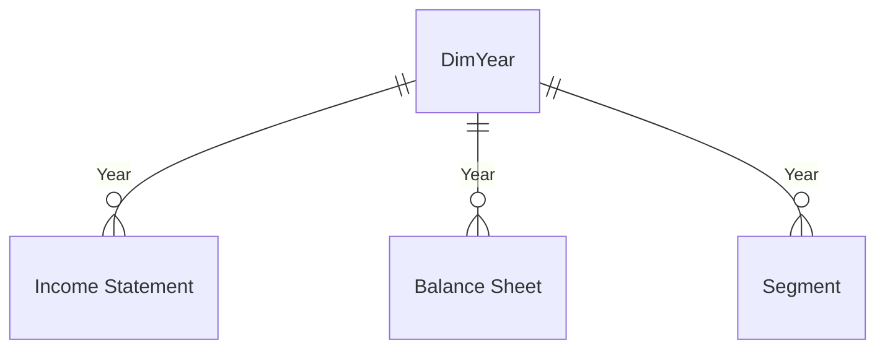

# HUL Financial Performance Dashboard | Power BI

A 1-page executive dashboard analyzing **Hindustan Unilever Limited's** financial performance across FY2022–FY2025, built end-to-end in Power BI Desktop — data modeling, DAX measure design, and dashboard storytelling.

  

---

## 📊 Dashboard Preview

> *Add your exported dashboard screenshot here:* `screenshots/dashboard_overview.png`

---

## 🎯 Project Overview

This project turns four years of HUL's Income Statement, Balance Sheet, and Segment financials into a single, decision-ready dashboard page. The brief was deliberately tight — **one page, important measures only** — which pushed the focus toward data modeling discipline and DAX correctness rather than visual sprawl.

**Business questions answered:**
- How has revenue and profitability trended across FY2022–FY2025?
- Which business segment (Home Care / Beauty & Personal Care / Foods & Refreshment) drives the most revenue and profit?
- Is the balance sheet getting stronger or weaker — liquidity, leverage, returns?
- What's the year-over-year growth story, not just the static snapshot?

---

## 🧱 Data Model

Star schema with `DimYear` as the single dimension driving three fact tables:



| Table | Type | Grain |
|---|---|---|
| `DimYear` | Dimension | One row per fiscal year (FY2022–FY2025), with a hidden numeric sort key |
| `Income Statement` | Fact | Long format — Year / Metric / Value (15 line items) |
| `Balance Sheet` | Fact | Long format — Year / Metric / Value (17 line items) |
| `Segment` | Fact | Wide format — Year / Segment / Revenue / Profit / Margin |
| ` Measures` | Measure home | All 40 DAX measures, organized into 4 display folders |

**Design choice:** the Income Statement and Balance Sheet were deliberately kept in long (Year/Metric/Value) format rather than pivoted to wide columns. Every line item is retrieved with a `CALCULATE(SUM(...), [Metric] = "X")` pattern — this keeps the model flexible (new line items only need a new measure, not a schema change) and avoids the engine/Power Query desync risk that comes with patching M-queries directly.

---

## 📐 DAX Measures (40 total, 4 folders)

| Folder | Count | Examples |
|---|---|---|
| 01 Income Statement | 15 | Total Revenue, EBITDA Margin %, Net Profit Margin %, Dividend Payout % |
| 02 Balance Sheet | 17 | Current Ratio, Debt to Equity, ROE %, ROA %, ROIC % |
| 03 Segment & Profitability | 5 | Segment Revenue Share %, Segment EBIT Margin %, Best Performing Segment |
| 04 Growth & YoY | 3 | Revenue YoY %, Net Income YoY %, EBITDA YoY % |

**Engineering highlight:** all margin/ratio measures are computed from base additive measures (e.g. `Operating Margin % = DIVIDE([Operating Income], [Total Revenue])`) rather than summing the source file's stored percentage rows — this keeps every ratio mathematically correct under any multi-year filter selection, which naive "sum the % column" approaches silently break.

Full DAX for every measure is in [`DAX_MEASURES.md`](./DAX_MEASURES.md).

---

## 📈 Key Insights

- **Revenue grew from ₹5,15,480 Cr (FY22) to ₹6,22,880 Cr (FY25)** — a ~6.5% CAGR, but growth decelerated sharply from +15.5% YoY in FY23 to ~+2% in FY24 and FY25.
- **Beauty & Personal Care is the profit engine** — ~37% of revenue but the highest segment margin every year (25.6%–27.6%), consistently the "Best Performing Segment."
- **Balance sheet is conservatively run** — Debt-to-Equity stayed at just 0.02–0.03 throughout, while ROE climbed from 18.1% to 21.5%.
- **Liquidity tightened in FY25** — Current Ratio dropped from 1.66 (FY24) to 1.33 (FY25), driven by a 28% jump in current liabilities.
- **Dividend policy is aggressive** — payout ratio exceeded 100% in FY22 (135%), meaning the company returned more to shareholders than it earned that year, drawing on retained earnings.

---

## 🛠️ Tech Stack
- **Power BI Desktop** — data modeling, DAX, report design
- **Power Query (M)** — source extraction and header repair
- **DAX** — 40 measures, including a custom metric-selector switch pattern for compact financial-statement matrices
- **Excel** — source financial data (Income Statement, Balance Sheet, Segment)

## 📁 Repository Structure
```
├── README.md                  # This file
├── PROJECT_REPORT.md          # Detailed methodology & insights report
├── DAX_MEASURES.md            # Full DAX reference, all 40 measures
├── HUL_Dashboard_Theme.json   # Power BI custom theme
└── screenshots/                # Dashboard screenshots
```

## 🚀 How to Use
1. Open the `.pbix` file in Power BI Desktop
2. Apply the theme: **View → Themes → Browse for themes** → `HUL_Dashboard_Theme.json`
3. Interact via the Year slicer (top-right) to filter KPI cards, segment charts, and the balance sheet snapshot

---

## 👤 Author
**Abhishek** — MBA (Analytics & Data Science), Manipal University Jaipur
Connect: [GitHub](https://github.com/rudrabhishek78372-stack)
